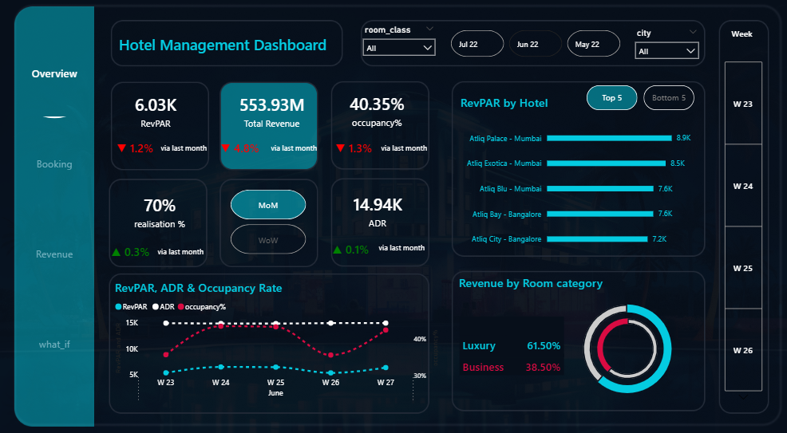

# 🏨 Hotel Performance Analysis Dashboard

---

## 📊 Overview
This project analyzes hotel performance using Power BI by building a structured data model that connects multiple datasets to generate actionable insights.

The goal is to understand the key drivers of hotel performance such as pricing strategy, demand, customer experience, and booking channels.

---

## 🎯 Objective
- Analyze pricing strategy vs demand
- Evaluate customer experience impact on performance
- Assess booking channels efficiency
- Identify revenue optimization opportunities

---

## 📌 Key KPIs
- Occupancy Rate  
- Average Daily Rate (ADR)  
- Revenue  
- Revenue per Available Room (RevPAR)

---

## 📊 Key Insights
- Increasing ADR without sufficient demand leads to lower Occupancy and RevPAR, showing the importance of dynamic pricing.
- Mumbai recorded the highest RevPAR among all cities.
- Hotel ratings have a strong impact on occupancy more than revenue.
- Most bookings come from short lead time (<7 days), affecting forecasting accuracy.
- Direct bookings have lower revenue than OTA but strong growth potential.
- Elite & Premium rooms show the highest performance.

---

## 💡 Recommendations
- Encourage early bookings to improve demand forecasting.
- Improve customer ratings by enhancing guest experience.
- Strengthen direct booking channels to reduce OTA commission costs.
- Maintain OTA as a key channel while balancing direct bookings.

---

## 🛠️ Tools Used
- Power BI  
- Data Modeling  
- Data Visualization
  
---

## 🔗 Project Sharing

👉 LinkedIn Case Study: https://www.linkedin.com/posts/aml-ghazy-b1a50b3a4_hotelmanagement-hospitalityindustry-hotelanalytics-ugcPost-7454551133848690688-8QxB?utm_source=share&utm_medium=member_desktop&rcm=ACoAAGMIDIYBHodAL2wtNlFwkDPUWM0DzigmRgk

